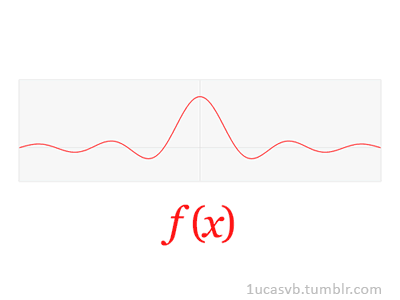

# 什么是图卷积神经网络？

图在生活无处不在，在各个方面体现着，比如社交网络，蛋白质结构等。现在开始学习图卷积神经网络。

## 什么是Convolution？

**Convolution**的数学定义是：
$$
(f*g)(t) = \int_R f(x)g(t-x)dx
$$

一般称$g$为作用在$f$上的$filter$或$kernel$。

一维的卷积示意图如下：


常见的$CNN$二维卷积示意图如下：


这是一个简单的$3\times 3$卷积层，每个新特征的学习是这样的：对其领域（$3\times 3$局部空间）的特征进行变换（$w_ix_i$），然后求和（$\sum\limits_{i}w_ix_i$）。

在抽象的graph里面卷积该怎么表示？


比如这个社交网络抽象出来的`graph`里面，有的社交`vip`会关联上万的节点，这些节点没有空间上的位置关系，也就没办法通过上面给出的传统卷积公式进行计算。

## Fourier变换

为了解决graph上卷积计算的问题，引入**Fourier变换**。

* 傅里叶级数表达式

设一个周期等于$T$，现定义区间为$[-\frac{T}{2},\frac{T}{2}]$的周期函数$f(x)$，傅里叶级数近似的表达式如下：
$$
f(x) = C + \sum\limits_{n=1}^{\infty}(a_n\cos(\frac{2\pi n}{T}x)+b_n\sin{(\frac{2\pi n}{T})}x)，其中C=\frac{a_0}{2}
$$
利用**偶函数$\times $奇函数$=$奇函数**的性质可以得到如下：
$$
\begin{align}
a_n &= \frac{\int_{-\frac{T}{2}}^{\frac{T}{2}}f(x)\cos{(\frac{2\pi n}{T}x)dx}}{\int_{-\frac{T}{2}}^{\frac{T}{2}}\cos^2{(\frac{2\pi n}{T}x)dx}} \\
&=\frac{T}{2}\int_{-\frac{T}{2}}^{\frac{T}{2}}f(x)\cos{(\frac{2\pi n}{T}x)dx} \\
b_n &= \frac{\int_{-\frac{T}{2}}^{\frac{T}{2}}f(x)\sin{(\frac{2\pi n}{T}x)dx}}{\int_{-\frac{T}{2}}^{\frac{T}{2}}\sin^2{(\frac{2\pi n}{T}x)dx}} \\
&=\frac{T}{2}\int_{-\frac{T}{2}}^{\frac{T}{2}}f(x)\sin{(\frac{2\pi n}{T}x)dx} \\
\end{align}
$$
由欧拉公式$e^{ix}=\cos x + i\sin x$，可知：
$$
\cos x = \frac{e^{ix}+e^{-ix}}{2}，\sin x = \frac{e^{ix}-e^{-ix}}{2i}=-i\cdot \frac{e^{ix}-e^{-ix}}{2}
$$
将如上公式的$\cos ({\frac{2\pi n}{T}x})$和$\sin (\frac{2\pi n}{T}x)$的线性组合式改写如下：
$$
\begin{align}
a_b\cos (\frac{2\pi n}{T}x)+b_n\sin (\frac{2\pi n}{T}x) &= a_n(\frac{e^{i\frac{2\pi n}{T}x}+e^{-i\frac{2\pi n}{T}x}}{2})
+b_n(\frac{e^{i\frac{2\pi n}{T}x}-e^{-i\frac{2\pi n}{T}x}}{2i}) \\
&= \frac{a_n-ib_n}{2}e^{i\frac{2\pi n}{T}x}+(\frac{a_n+ib_n}{2}e^{-i\frac{2\pi n}{T}x})\\
&= c_ne^{i\frac{2\pi n}{T}x}+c_{-n}e^{-i\frac{2\pi n}{T}x}
\end{align}
$$
其中$c_n = \frac{a_n-ib_n}{2}$，且由$a_n$为偶函数，$b_n$为奇函数，可得$c_{-n}=\frac{a_{-n}-ib_{-n}}{2}=\frac{a_n+ib_n}{2}$。

当$n=0$时，有$c_0=\frac{a_0}{2}$，代回$f(x)$中，有，
$$
f(x) = \sum\limits_{n=-\infty}^{\infty}c_n\cdot e^{i\frac{2\pi n }{T}x}
$$
其中，$c_n$为基的坐标，$e^{i\frac{2\pi n}{T}x}$为正交基。

将$a_n$，$b_n$结果带入$c_n$可知：
$$
c_n = \frac{1}{T}\int_{-T/2}^{T/2}f(x)(\cos{(\frac{2\pi n}{T}x)}-i\sin(\frac{2\pi n}{T}x))dx = \frac{1}{T}\int_{-T/2}^{T/2}f(x)e^{-i\frac{2\pi n}{T}x}dx
$$
现在公式用频率$\Delta w=\frac{2\pi}{T}$替换，再令$\omega_n=\Delta \omega n$，有：
$$
f(x) = \sum\limits_{n=-\infty}^{\infty}\frac{1}{T}\int_{-T/2}^{T/2}f(x)e^{-i\frac{2\pi n}{T}x}dx\cdot e^{i\frac{2\pi n }{T}x} =
\sum\limits_{n=-\infty}^{\infty}\frac{\Delta \omega}{2\pi}\int_{-T/2}^{T/2}f(x)e^{-i\omega_n x}dx \cdot e^{-i\omega_nx}
$$
令$T\rightarrow \infty$，有$\Delta \omega\rightarrow 0$，并设$F(\omega)=\mathop{\lim}_{T\rightarrow \infty}\int_{-T/2}^{T/2}f(x)e^{-i\omega x}dx$，有：
$$
\begin{align}
f(x)&=\sum\limits_{n=0}^{\infty}\frac{\Delta \omega}{2\pi}F(\omega_n)\cdot e^{-i\omega_nx}\\
&=\frac{1}{2\pi}F(\omega_n)\sum\limits_{n=0}^{\infty} F(\omega_n)\cdot e^{-i\omega_nx} \Delta \omega\\
&=\frac{1}{2\pi}\int_{-\infty}^{+\infty}F(\omega)e^{-i\omega x}d\omega
\end{align}
$$
可推得如下：
$$
\begin{align}
F(\omega)&=\int_{-\infty}^{+\infty}f(x)e^{-i\omega x}dx = \int_R f(x)e^{-2\pi ix\xi}dx，其中\xi为任意实数
\end{align}
$$

* 卷积公式

根据卷积定理，卷积公式可以写成：
$$
f*g=\mathcal{F}^{-1}\{\mathcal{F}\{f\}\cdot\mathcal{F}\{g\}\}
$$
证明：

$Fourier$变换的定义：$\mathcal{F}\{f\}(v) = \int_R f(x)e^{-2\pi ix\cdot v}dx$，$Inverse\ Fourier$变换则是：$\mathcal{F}^{-1}\{f\}(x) = \int_Rf(v)e^{2\pi ix\cdot v}dv$，

定义$h$是$f$和$g$的卷积，有$h(z) = \int_Rf(x)g(z-x)dx$，于是
$$
\begin{align}
\mathcal{F}\{f*g\}(v)&=\mathcal{F}\{h\}(v)\\&=\int_Rh(z)e^{-2\pi iz\cdot v}dz\\&=\int_R\int_Rf(x)g(z-x)e^{-2\pi iz\cdot v}dxdz\\&=\int_Rf(x)dx\int_Rg(z-x)e^{-2\pi iz\cdot v}dz
\end{align}
$$
带入$y=z-x；dy=dz$，有：
$$
\begin{align}
\mathcal{F}\{f*g\}(v) &= \int_Rf(x)(\int_Rg(y)e^{-2\pi i(y+x)\cdot v}dy)dx \\
&= \int_Rf(x)e^{-2\pi ix\cdot v}(\int_Rg(y)e^{-2\pi iy\cdot v}dy)dx \\
&= \int_Rf(x)e^{-2\pi ix\cdot v}dx\int_Rg(y)e^{-2\pi iy\cdot v}dy \\
&=\mathcal{F}\{f\}(v)\cdot \mathcal{F}\{g\}(v)
\end{align}
$$
同时对等式两边同时乘以$\mathcal{F}^{-1}$，得到：
$$
f*g = \mathcal{F}^{-1}\{\mathcal{F}\{f\}\cdot \mathcal{F}\{g\}\}
$$
这样只需要定义graph上的**Fourier变换**，就可以定义出graph上的**convolution变换**。



**Fourier变换**的定义：
$$
F(f)=\int_R f(x)e^{-2\pi ix\xi}dx，其中\xi为任意实数
$$

## Laplacian算子

**一阶导数定义**：
$$
f^{'}(x) = \mathop{lim}_{h\rightarrow0} \frac{f(x+h)-f(x)}{h}
$$
**laplacian算子**简单来说二阶导数：
$$
\Delta f(x)= f^{''}(x) = \mathop{lim}_{h\rightarrow0} \frac{f(x+h)-2f(x)+f(x-h)}{h^2}
$$
那么在graph上，定义一阶导数为：
$$
f^{'}_{*g}(x)=f(x)-f(y)
$$
其中，$y$是$x$的邻居节点，那么对应的**Laplacian算子**可以定义为：
$$
\Delta_{*g}f'(x)=\sum\limits_{y\sim x}[f(x)-f(y)]
$$
定义$D$为$N\times N$的度矩阵为：
$$
D(i,j) = \left\{\begin{matrix}
d_i&if\ \ {i=j} \\
0&otherwise
\end{matrix} \right.
$$

定义$A$为$N\times N$邻接矩阵为：
$$
A(i,j) = \left\{\begin{matrix}
1&if\ \ x_i\sim x_j \\
0&otherwise
\end{matrix} \right.
$$
$Laplacian$算子定义为：
$$
L = D - A
$$
标准化后得到：
$$
L = I_N - D^{-\frac{1}{2}}AD^{\frac{1}{2}}
$$
定义$Laplacian$算子的目的是为了找到$Fourier$变换的基比如传统$Fourier$变换的基$e^{2\pi ix\cdot \xi}$就是$Laplacian$算法的一组特征向量：
$$
\Delta e^{2\pi ix\cdot \xi} = \lambda e^{2\pi ix\cdot \xi}，其中\lambda为一个常数
$$
那么图上的$Fourier$基就是$L$矩阵的$n$个特征向量$U=[u_1,\cdots,u_n]$， $L$可以分解为：
$$
L = U\Lambda U^T
$$
其中，$\Lambda$为特征值矩阵。

至于为什么要做特征分解，因为在$Graph$中，**我们没必要每次都去更新全局，而是可以只关注一阶或二阶**。拉普拉斯矩阵的特征分解可以达到目的。

|                   | 传统$Fourier$变换       | $Graph\ Fourier$变换 |
| ----------------- | ----------------------- | -------------------- |
| $Fourier$变换基   | $e^{-2\pi ix\cdot \xi}$ | $U^T$                |
| 逆$Fourier$变换基 | $e^{2\pi ix\cdot \xi}$  | $U$                  |
| 维度              | $\infty$                | 点的个数$n$          |

那么$Graph\ Fourier$变换定义为：
$$
\mathcal{GF}\{f\}(\lambda_l) = \sum\limits_{i=1}^nf(i)u_l^*(i)
$$
其中$f(i)$可以看做是作用第$i$个点上的$signal$，用向量$x=(f(1),\cdots,f(n)) \in \mathbb{R}^n$来表示；$u_l^*$是$u_l$的对偶向量，$u_l^*$是矩阵$U^T$的第$l$行，$u_l$是矩阵$U$的第$l$行。

用矩阵形式来表示$Graph\ Fourier$变换：
$$
\mathcal{GF}\{x\} = U^Tx
$$
类似的$Inverse\ Graph\ Fourier$变换定义为：
$$
\mathcal{IGF}\{\hat f\}(i) = \sum\limits_{l=0}^{n-1}\hat f(\lambda_l)u_l(i)
$$


其矩阵形式为：
$$
\mathcal{IGF}\{x\} = Ux
$$

## 推导Graph Convolution

由卷积公式：
$$
f*g = \mathcal{F}^{-1}\mathcal{\{F\{f\}\cdot F\{g\}\}}，\mathcal{GF}\{x\} = U^Tx，\mathcal{IGF}\{x\} = Ux
$$
可知，图的卷积公式可以表示为：
$$
g*x = U(U^Tg\cdot U^Tx)
$$
作为图卷积的$filter$函数$g$ ，我们希望具有很好的局部性。就像$CNN$模型里的$filter$一样，只影响到一个像素附近的像素。那么我们可以把$g$定义成一个$laplacian$矩阵的函数$g(L)$。


作用一次$laplacian$矩阵相当于在图上传播了一次邻居节点。进一步我们可以把$U^Tg$看做是$g_{\theta}(\Lambda)$一个$laplacian$特征值的函数，参数为$\theta$。

改写上面的图卷积公式，可以得到如下：
$$
g_{\theta}*x = U_{g_{\theta}}U^Tx = U_{g_{\theta^{'}}}(\Lambda)U^Tx
$$
由于复杂度太高，通过切比雪夫多项式$T_k(x)$展开到第$K$阶：
$$
g_{\theta^{'}}(\Lambda) \approx \sum\limits_{k=0}^K\theta^{'}_kT_k( \widetilde{L})
$$
其中$ \widetilde{L}=\frac{2}{\lambda_{max}}L-I_N$，可以通过$U\Lambda^kU^T=(U\Lambda^kU^T)^k=L^k$进行验证。

设$K=1$，卷积公式可以简化为：
$$
g_{\theta^{'}}*x \approx \theta(I_N+L)x = \theta(I_N+D^{-\frac{1}{2}}AD^{-\frac{1}{2}})x
$$
令$\widetilde A = A+I_N$，$\widetilde D_{ii} = \sum\limits_j\widetilde{A}_{ij}$，有
$$
g_{\theta^{'}}*x = \theta(\widetilde  D^{-\frac{1}{2}}\widetilde  A\widetilde  D^{-\frac{1}{2}})x
$$

## 学习新特征

在深度学习中最重要的学习特征：随着网络层数的增加，特征越来越抽象，然后用于最终的任务。对于图任务来说，这点同样适用，我们希望深度模型从图的最初始特征$X$出发学习到更抽象的特征，比如学习到了某个节点的高级特征，这个特征根据图结构融合了图中其他节点的特征，这样就可以用这个特征用于节点分类或者属性预测。

对于GCN模型，目标是学习作为输入的图上的特征的函数，该函数作为输入：

* 每个节点$i$的特征描述$x_i$：归纳为$N\times D$特征矩阵$X$（$N$：节点数，$D$：输入特征数）

* 矩阵形式的图形结构的代表性描述：通常以邻接矩阵的形式进行表示

  并生成节点级输出$Z$（$N\times F$特征矩阵，其中$F$是每个输出特征的数量节点）。图级输出可以引入某种形式的池化操作来建模，然后可以将每个神经网络层写为非线性函数：
  $$
  \textbf{H}^{(\textbf{l}+1)} = f(\textbf{H}^{(\textbf{l})},\textbf{A})
  $$
  其中，$H^{(0)} = X$，$H^{(L)} = Z$，$L$表示层数，然后特定模型仅在如何选择和参数化$f(\cdot,\cdot)$方面有所不同。

## 一个简单的例子

例如，考虑以下非常简单的分层传播规则形式：
$$
f(H^{(l)},A) = \sigma(AH^{(L)}W^{(l)})
$$
其中，$W^{(l)}$表示第$l$个神经网络层的权重矩阵，而$\sigma(\cdot)$是类似于$ReLU$的非线性激活函数（一个很强大的激活函数）。

可以将上述学习分成三个部分：

- 变换（transform）：对当前的节点特征进行变换学习，这里就是乘法规则（$Wx$）；
- 聚合（aggregate）：聚合领域节点的特征，得到该节点的新特征，这里是简单的加法规则；
- 激活（activate）：采用激活函数，增加非线性。

但是该模型有两个**局限性**：

* 与$A$的乘法意味着，对于每个节点，将所有邻近节点的所有特征向量相加，但不包括节点本身(除非图中存在自循环)。可以通过在图中执行自我循环来“修复”这个问题:只需将单位矩阵添加到$A$中，即$\hat A = A+I$。
* $A$通常没有被规范化，因此是与$A$的矩阵乘法完全改变特征向量的尺度(可以通过观察$A$的特征值来理解)，对$A$进行归一化，使所有行和为1，即$D^{-1}A$，其中$D$是对角节点度矩阵，就可以解决这个问题。现在与$D^{-1}A$相乘就相当于取邻近节点特征的平均值。

当使用对称归一化时，有$D^{-\frac{1}{2}}AD^{-\frac{1}{2}}$，可以得到如下：
$$
H^{(l+1)} = f(H^{(l)},A) = \sigma(\hat D^{-\frac{1}{2}}\hat A\hat D^{-\frac{1}{2}}H^{(L)}W^{(l)})
$$
其中，$\hat A = A+I$，$I$是单位矩阵，$D$是$A$的对角节点矩阵。

> 实际例子，详细查阅$T Kipf$关于`GCN`的第三部分

定义了图卷积，我们只需要将图卷积层堆积起来就构成了图卷积网络**GCN**：


## Weisfeiler-Lehman算法与GCN

可以将$gcn$模型解释为图形上著名的**Weisfeiler-Lehman**算法的广义，一维WL算法的工作原理如下：

对于所有节点$v_i \in \mathcal{G}$：

* 获取相邻节点$\{v_j\}$的特征$\{h_{vj}\}$
* 更新节点特征$h_{vi}\leftarrow hash(\sum\limits_jh_{vj})$，其中$hash(\cdot)$是一个内射哈希函数

回到图卷积逐层传播规则：
$$
h_{vi}^{(l+1)} = \sigma(\sum\limits_j\frac{1}{c_{ij}}h_{vj}^{(l)}W^{(l)})
$$
其中$j$为$v_i$的第$j$个相邻节点的索引，$c_{ij}$是边$(v_i,v_j)$的归一化常数，这个源于使用$GCN$模型的对成归一化邻接矩阵$D^{-\frac{1}{2}}AD^{-\frac{1}{2}}$。

现在看到该传播规则可以解释为$WL$带有$W$的变体，如果现在选择合适的非线性度并初始化随机权重矩阵以使其正交，此更新规则实际上变得更稳定，得到了有意义的平滑嵌入，在这里可以将距离解释为局部图结构的（不）相似性。

## 图神经网络

其实图神经网路（GNN，Graph Neural Network）是一个庞大的家族，如果按照$f$分类，其可以分成以下类型：


## 实现

加载数据

```
# 数据预处理
import numpy as np
import scipy.sparse as sp
import torch

def encode_onehot(labels):
    """
    将类别表示为one-hot形式的矩阵表示
    """
    classes = set(labels)
    classes_dict = {
        c:np.identity(len(classes))[i,:] for i,c in enumerate(classes)
    }
    """
    >>> a = {"a":1,"b":2}
    >>> labels = ['a','b','a','a']
    >>> list(map(a.get,labels))
    [1, 2, 1, 1]
    """
    # 标签类别转换位onehot形式
    labels_onehot = np.array(list(map(classes_dict.get,labels)),dtype=np.int32)
    return labels_onehot

def normalize(mx):
    """
    首先对每一行求和得到rowsum；求倒数得到r_inv；
    如果某一行全为0，则r_inv算出来会等于无穷大，将这些行的r_inv置为0；
    构建对角元素为r_inv的对角的元素；
    用对角矩阵与原始矩阵的点积起到标准化的作用，原始矩阵中每一行元素都会与对应的r_inv相乘。
    """
    rowsum = np.array(mx.sum(1))
    r_inv = np.power(rowsum, -1).flatten()
    r_inv[np.isinf(r_inv)] = 0.
    r_mat_inv = sp.diags(r_inv)
    mx = r_mat_inv.dot(mx)
    return mx
  
def sparse_mx_to_torch_sparse_tensor(sparse_mx):
    """Convert a scipy sparse matrix to a torch sparse tensor."""
    sparse_mx = sparse_mx.tocoo().astype(np.float32)
    indices = torch.from_numpy(
        np.vstack((sparse_mx.row, sparse_mx.col)).astype(np.int64))
    values = torch.from_numpy(sparse_mx.data)
    shape = torch.Size(sparse_mx.shape)
    return torch.sparse.FloatTensor(indices, values, shape)

# 加载数据
def load_data(path, dataset):
    """Load citation network dataset (cora only for now)"""
    print('Loading {} dataset...'.format(dataset))

    idx_features_labels = np.genfromtxt("{}{}.content".format(path, dataset),
                                        dtype=np.dtype(str))
    features = sp.csr_matrix(idx_features_labels[:, 1:-1], dtype=np.float32)
    labels = encode_onehot(idx_features_labels[:, -1])

    # build graph
    idx = np.array(idx_features_labels[:, 0], dtype=np.int32)
    idx_map = {j: i for i, j in enumerate(idx)}
    edges_unordered = np.genfromtxt("{}{}.cites".format(path, dataset),
                                    dtype=np.int32)
    edges = np.array(list(map(idx_map.get, edges_unordered.flatten())),
                     dtype=np.int32).reshape(edges_unordered.shape)
    adj = sp.coo_matrix((np.ones(edges.shape[0]), (edges[:, 0], edges[:, 1])),
                        shape=(labels.shape[0], labels.shape[0]),
                        dtype=np.float32)

    # build symmetric adjacency matrix
    adj = adj + adj.T.multiply(adj.T > adj) - adj.multiply(adj.T > adj)

    features = normalize(features)
    adj = normalize(adj + sp.eye(adj.shape[0]))

    idx_train = range(140)
    idx_val = range(200, 500)
    idx_test = range(500, 1500)

    features = torch.FloatTensor(np.array(features.todense()))
    labels = torch.LongTensor(np.where(labels)[1])
    adj = sparse_mx_to_torch_sparse_tensor(adj)

    idx_train = torch.LongTensor(idx_train)
    idx_val = torch.LongTensor(idx_val)
    idx_test = torch.LongTensor(idx_test)
    
    # 邻接矩阵；特征；类别；训练集合测试集
    return adj, features, labels, idx_train, idx_val, idx_test


load_data(path="./data/cora/",dataset="cora")
```

对图卷积层的进行实现

```
# 图卷积
import torch,math
from torch.nn.parameter import Parameter
from torch.nn.modules.module import Module

class GraphConvolution(torch.nn.Module):
    
    """
    GCN Layer
    """
    
    def __init__(self,in_features,out_features,bias=True):
        super(GraphConvolution,self).__init__()
        self.in_featues = in_features
        self.out_features = out_features
        
        """
        torch.nn.parameter.Parameter(torch.FloatTensor(hidden_size))：
        Parameter是Tensor，即 Tensor 拥有的属性它都有，⽐如可以根据data 来访问参数数值，⽤ grad 来访问参数梯度。
       
       
        register_parameter：向建立的网络module添加 parameter；最大的区别：parameter可以通过注册网络时候的name获取。
       
       """
        self.weight = Parameter(torch.FloatTensor(in_features,out_features))
        if bias:
            self.bias = Parameter(torch.FloatTensor(out_features))
        else:
            self.register_parameter('bias',None)
            
        # 初始化参数
        self.reset_parameters()
        
    def reset_parameters(self,):
        stdv = 1. / math.sqrt(self.weight.size(1))
        # 使用均匀分布来初始化其权重
        self.weight.data.uniform_(-stdv,stdv)
        if self.bias is not None:
            self.bias.data.uniform_(-stdv,stdv)
            
    def forward(self,input,adj):
        # AXW
        ## XW 
        support = torch.mm(input,self.weight) # torch.mm：矩阵相乘
        ## A(XW)
        output = torch.spmm(adj,support) # 稀疏矩阵相乘
        
        if self.bias is not None:
            return output + self.bias
        else:
            return output
        
    def __repr(self,):
        return "{}({}->{})".format(self.__class__.__name__,str(self.in_features),str(self.out_features)) 
```

对于GCN，只需要将图卷积层堆积起来就可以，实现一个两层的GCN：

```
import torch.nn.functional as F

class GCN(torch.nn.Module):
    
    def __init__(self,nfeat,nhid,nclass,dropout):
        """
        nfeat：特征数
        nhid：隐藏层大小
        nclass：目标维度
        """
        super(GCN,self).__init__()
        self.gc1 = GraphConvolution(nfeat,nhid)
        self.gc2 = GraphConvolution(nhid,nclass)
        self.dropout = dropout
        
        
    def forward(self,x,adj):
        x = F.relu(self.gc1(x,adj))
        # 带Dropout的网络可以防止出现过拟合。
        x = F.dropout(x,self.dropout,training=self.training)
        # 列的和为1
        x = F.log_softmax(self.gc2(x,adj),dim=1)
        return x
```

定义一个计算准确率的函数：

```
# 准确率
def accuracy(output, labels):
    preds = output.max(1)[1].type_as(labels)
    correct = preds.eq(labels).double()
    correct = correct.sum()
    return correct / len(labels)
```

然后配置相关的参数变量

```
# Training settings

from types import SimpleNamespace
import torch

args = {
    'seed':42,
    'no_cuda':False,
    'fastmode':False, # Validate during training pass.
    'epochs':200, # 步长
    'lr':0.01, # 学习率
    'weight_decay':5e-4, # 权重衰减（L2惩罚）（默认: 0）
    'hidden':16, # 隐藏层
    'dropout':0.5,
}
# 将字典转换为对象
args = SimpleNamespace(**args)
# 检查cuda是否可用
args.cuda = not args.no_cuda and torch.cuda.is_available()
np.random.seed(args.seed)
torch.manual_seed(args.seed) #为CPU设置种子用于生成随机数，以使得结果是确定的
if args.cuda: #为当前GPU设置随机种子；如果使用多个GPU，应该使用torch.cuda.manual_seed_all()为所有的GPU设置种子。
    torch.cuda.manual_seed(args.seed)
```

之后导入数据

```
# Load data
adj, features, labels, idx_train, idx_val, idx_test = load_data(path="./data/cora/",dataset="cora")
```

定义模型和优化器

```
# 模型和优化器
model = GCN(nfeat=features.shape[1],
            nhid=args.hidden,nclass=labels.max().item()+1,
            dropout=args.dropout)
optimizer = torch.optim.Adam(model.parameters(),
                      lr=args.lr,weight_decay=args.weight_decay)
```

对数据进行迁移内存

```
if args.cuda: # 对model自身进行的内存迁移
    """
    model = model.cuda() 
    <=>
    model.cuda() 
    """
    model.cuda()
    features = features.cuda()
    adj = adj.cuda()
    labels = labels.cuda()
    idx_train = idx_train.cuda()
    idx_val = idx_val.cuda()
    idx_test = idx_test.cuda()
```

进行训练数据

```
import time
import torch.nn.functional as F
def train(epoch):
    t = time.time()
    """
    model.eval()，pytorch会自动把BN和DropOut固定住，不会取平均，而是用训练好的值。不然的话，一旦test的batch_size过小，很容易就会被BN层导致生成图片颜色失真极大；在模型测试阶段使用

    model.train() 让model变成训练模式，此时 dropout和batch normalization的操作在训练q起到防止网络过拟合的问题
    """
    model.train()
    optimizer.zero_grad()
    output = model(features,adj)
    loss_train = F.nll_loss(output[idx_train],labels[idx_train])
    acc_train = accuracy(output[idx_train],labels[idx_train])
    loss_train.backward()
    optimizer.step()
    
    
    if not args.fastmode:
        # Evaluate validation set performance separately,
        # deactivates dropout during validation run.
        model.eval()
        output = model(features, adj)
    
    loss_val = F.nll_loss(output[idx_val],labels[idx_val])
    acc_val = accuracy(output[idx_val],labels[idx_val])
    
    print('Epoch: {:04d}'.format(epoch+1),
          'loss_train: {:.4f}'.format(loss_train.item()),
          'acc_train: {:.4f}'.format(acc_train.item()),
          'loss_val: {:.4f}'.format(loss_val.item()),
          'acc_val: {:.4f}'.format(acc_val.item()),
          'time: {:.4f}s'.format(time.time() - t))
          
t_total = time.time()
for epoch in range(args.epochs):
    train(epoch)
print("Optimization Finished!")
print("Total time elapsed: {:.4f}s".format(time.time() - t_total))
```

然后，对测试集进行训练

```
def test():
    model.eval()
    output = model(features,adj)
    loss_test = F.nll_loss(output[idx_test],labels[idx_test])
    acc_test = accuracy(output[idx_test],labels[idx_test])
    print("Test set results:",
          "loss= {:.4f}".format(loss_test.item()),
          "accuracy= {:.4f}".format(acc_test.item()))
test()
```

**原学习地址链接**：[图卷积网络(GCN)新手村完全指南](https://zhuanlan.zhihu.com/p/54505069)

**T Kipf的文章**：[GRAPH CONVOLUTIONAL NETWORKS](https://tkipf.github.io/graph-convolutional-networks/)

**T Kipf的论文**：[SEMI-SUPERVISED CLASSIFICATION WITH GRAPH CONVOLUTIONAL NETWORKS](https://arxiv.org/pdf/1609.02907.pdf )  

**T Kipf的图卷积神经网络代码实现**：[pygcn](https://github.com/tkipf/pygcn)

